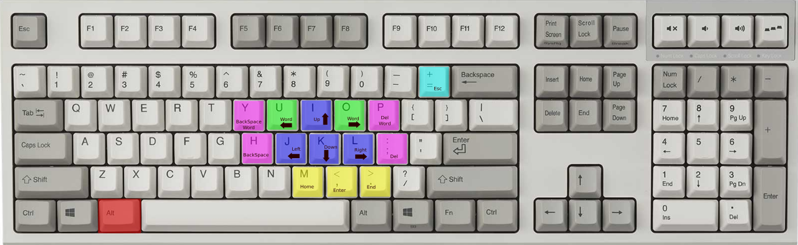
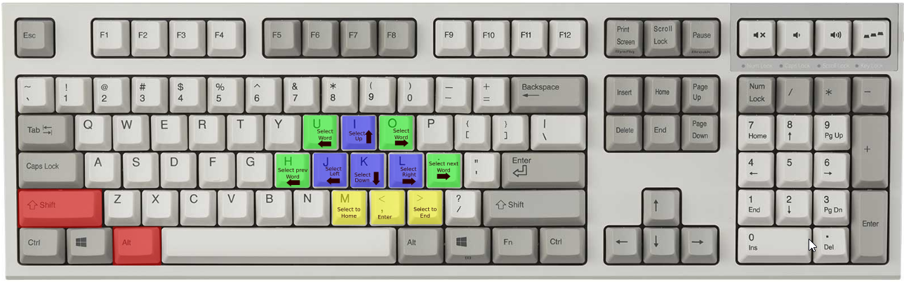
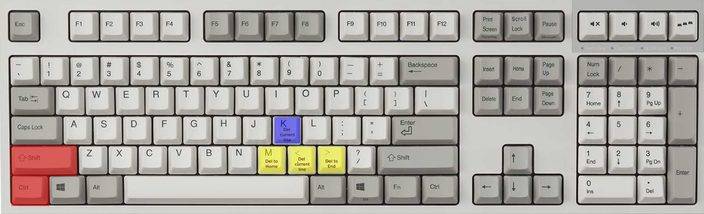
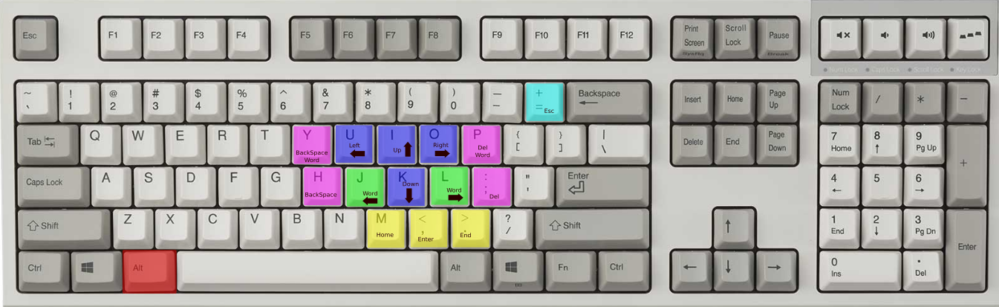
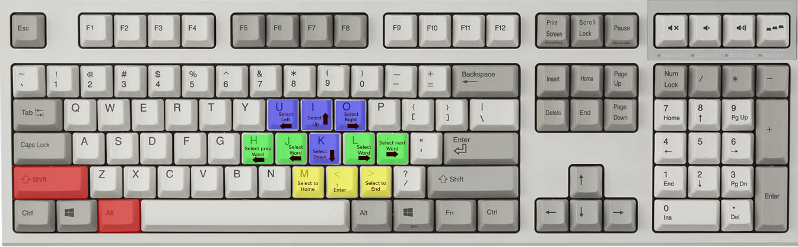
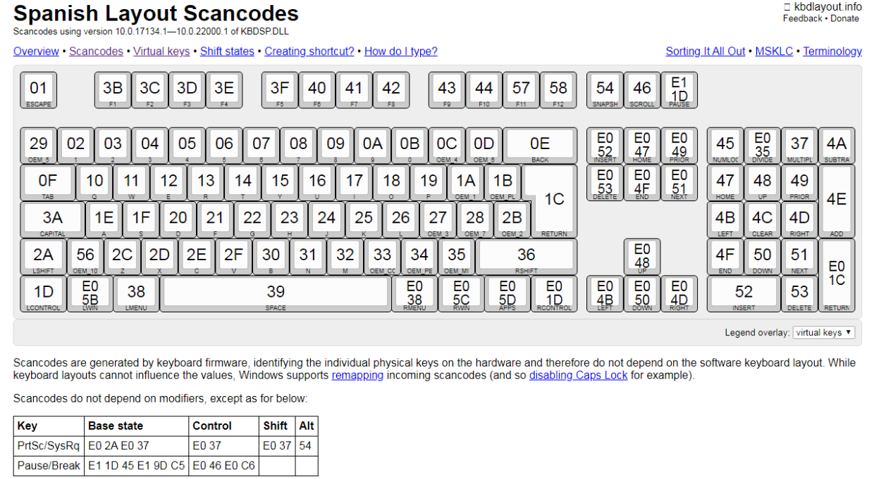

# RemapMoveKeys
## Description:
autor: lib.bioq@gmail.com
versión: 2.0.0
Descripción: Re-mapea las teclas direccionales para que su digitación sea más cómodo y evitar el movimiento brusco de la mano hacia las teclas direccionales.


## Install

- Download and Install [Autohotkey](https://www.autohotkey.com/)

- Download source from repositories

- Execute Script **RemapMoveKeysMain.ahk**

- **miscellaneous**: automatize for execute script when windows start

  ## Config: Standar or Reverse

- La configuración **Reverse** ya esta activa por defecto

- Abre el archivo **RemapMoveKeysMain.ahk** con un editor de texto 

- Busca la línea **Configuración**:

  ```bash
  ;* ----- Configuración -------------------------------------------------
  #Include, %A_ScriptDir%\RemapMoveKeys_reverse.ahk
  ;#Include, %A_ScriptDir%\RemapMoveKeys_standar.ahk
  ; ----------------------------------------------------------------------
  ```
- Comenta y descomerte utilizando **coma(;)**:  **RemapMoveKeys_reverse.ahk** o **RemapMoveKeys_standar.ahk**  según su preferencia.

## Using

### **Remember**:

> El re-mapeo de teclas es independiente del idioma del teclado ya que la distribución de teclas se realizó mediante **scancodes**.

De acuerdo a la descripción anterior tomar la combinacion de teclas utilizadas en las imagenes como referencias para ubicar el **short cut**  en su teclado.

### Remap Move Keys standard

---

#### Move cursor



**Note**: Keep pressed <kbd>Alt</kbd> key.

| Short cut                                   | Action                |
| ------------------------------------------- | --------------------- |
| <kbd>Alt</kbd>+<kbd>i</kbd>                 | Up                    |
| <kbd>Alt</kbd>+<kbd>k</kbd>                 | Down                  |
| <kbd>Alt</kbd>+<kbd>j</kbd>                 | Left                  |
| <kbd>Alt</kbd>+<kbd>l</kbd>                 | Right                 |
| <kbd>Alt</kbd>+<kbd>u</kbd>                 | Move a word left      |
| <kbd>Alt</kbd>+<kbd>o</kbd>                 | Move a word right     |
| <kbd>Alt</kbd>+<kbd>h</kbd>                 | Backspace             |
| <kbd>Alt</kbd>+<kbd>;</kbd> or <kbd>ñ</kbd> | Delete                |
| <kbd>Alt</kbd>+<kbd>y</kbd>                 | Erase a word to left  |
| <kbd>Alt</kbd>+<kbd>p</kbd>                 | Erase a word to right |
| <kbd>Alt</kbd>+<kbd>m</kbd>                 | Home                  |
| <kbd>Alt</kbd>+<kbd>,</kbd>                 | Enter                 |
| <kbd>Alt</kbd>+<kbd>n</kbd>                 | End                   |
| <kbd>Alt</kbd>+<kbd>=</kbd>                 | Scape                 |


#### Selections



**Note**: Keep pressed <kbd>Shift</kbd> + <kbd>Alt</kbd> keys.

| Short cut                                                    | Action                    |
| ------------------------------------------------------------ | ------------------------- |
| <kbd>Shift</kbd>+<kbd>Alt</kbd>+<kbd>i</kbd>                 | Select to Up              |
| <kbd>Shift</kbd>+<kbd>Alt</kbd>+<kbd>k</kbd>                 | Select to Down            |
| <kbd>Shift</kbd>+<kbd>Alt</kbd>+<kbd>j</kbd>                 | Select to Left            |
| <kbd>Shift</kbd>+<kbd>Alt</kbd>+<kbd>l</kbd>                 | Select to Right           |
| <kbd>Shift</kbd>+<kbd>Alt</kbd>+<kbd>u</kbd>                 | Select a word to left     |
| <kbd>Shift</kbd>+<kbd>Alt</kbd>+<kbd>o</kbd>                 | Select a word to right    |
| <kbd>Shift</kbd>+<kbd>Alt</kbd>+<kbd>h</kbd>                 | Select previous left word |
| <kbd>Shift</kbd>+<kbd>Alt</kbd>+<kbd>;</kbd> or <kbd>ñ</kbd> | Select Next right word    |
| <kbd>Shift</kbd>+<kbd>Alt</kbd>+<kbd>y</kbd>                 | Erase a word to left      |
| <kbd>Shift</kbd>+<kbd>Alt</kbd>+<kbd>p</kbd>                 | Erase a word to right     |
| <kbd>Shift</kbd>+<kbd>Alt</kbd>+<kbd>m</kbd>                 | Select to Home            |
| <kbd>Shift</kbd>+<kbd>Alt</kbd>+<kbd>n</kbd>                 | Select to End             |

#### Extra features



| Short cut                                         | Action                                                |
| ------------------------------------------------- | ----------------------------------------------------- |
| <kbd>Ctrl</kbd>+<kbd>Shift</kbd>+<kbd>m</kbd>     | Delete from current position to home                  |
| <kbd>Ctrl</kbd>+<kbd>Shift</kbd>+<kbd>,</kbd>     | Delete current line                                   |
| <kbd>Ctrl</kbd>+<kbd>Shift</kbd>+<kbd>.</kbd>     | Delete from current position to End                   |
| <kbd>Ctrl</kbd>+<kbd>Shift</kbd>+<kbd>k</kbd>     | Delete current line                                   |
| <kbd>Ctrl</kbd>+<kbd>Enter</kbd>                  | New line down                                         |
| <kbd>Ctrl</kbd>+<kbd>Shift</kbd>+<kbd>Enter</kbd> | New line up                                           |
| <kbd>AltGr</kbd>+<kbd>T</kbd>                     | Escape                                                |

#### For programmers shortcuts (put semicolon)
| Short cut                         | Action                                               |
| --------------------------------- | ---------------------------------------------------- |
| <kbd>Shift</kbd>+<kbd>Enter</kbd> | Puts ";" to End of current line                      |
| <kbd>Alt</kbd>+<kbd>Enter</kbd>   | Puts ";" to End of current line and goes to new line |

### Remap Move Keys Reverse

---

#### Move cursors



| Short cut                                   | Action                |
| ------------------------------------------- | --------------------- |
| <kbd>Alt</kbd>+<kbd>i</kbd>                 | Up                    |
| <kbd>Alt</kbd>+<kbd>k</kbd>                 | Down                  |
| <kbd>Alt</kbd>+<kbd>j</kbd>                 | Move a word left      |
| <kbd>Alt</kbd>+<kbd>l</kbd>                 | Move a word right     |
| <kbd>Alt</kbd>+<kbd>u</kbd>                 | Left                  |
| <kbd>Alt</kbd>+<kbd>o</kbd>                 | Right                 |
| <kbd>Alt</kbd>+<kbd>h</kbd>                 | Backspace             |
| <kbd>Alt</kbd>+<kbd>;</kbd> or <kbd>ñ</kbd> | Delete                |
| <kbd>Alt</kbd>+<kbd>y</kbd>                 | Erase a word to left  |
| <kbd>Alt</kbd>+<kbd>p</kbd>                 | Erase a word to right |
| <kbd>Alt</kbd>+<kbd>m</kbd>                 | Home                  |
| <kbd>Alt</kbd>+<kbd>,</kbd>                 | Enter                 |
| <kbd>Alt</kbd>+<kbd>n</kbd>                 | End                   |
| <kbd>Alt</kbd>+<kbd>=</kbd>                 | Scape                 |

#### Selections



| Short cut                                                    | Action                    |
| ------------------------------------------------------------ | ------------------------- |
| <kbd>Shift</kbd>+<kbd>Alt</kbd>+<kbd>i</kbd>                 | Select to Up              |
| <kbd>Shift</kbd>+<kbd>Alt</kbd>+<kbd>k</kbd>                 | Select to Down            |
| <kbd>Shift</kbd>+<kbd>Alt</kbd>+<kbd>j</kbd>                 | Select a word to Left     |
| <kbd>Shift</kbd>+<kbd>Alt</kbd>+<kbd>l</kbd>                 | Select a word to Right    |
| <kbd>Shift</kbd>+<kbd>Alt</kbd>+<kbd>u</kbd>                 | Select to left            |
| <kbd>Shift</kbd>+<kbd>Alt</kbd>+<kbd>o</kbd>                 | Select to right           |
| <kbd>Shift</kbd>+<kbd>Alt</kbd>+<kbd>h</kbd>                 | Select previous left word |
| <kbd>Shift</kbd>+<kbd>Alt</kbd>+<kbd>;</kbd> or <kbd>ñ</kbd> | Select Next right word    |
| <kbd>Shift</kbd>+<kbd>Alt</kbd>+<kbd>y</kbd>                 | Erase a word to left      |
| <kbd>Shift</kbd>+<kbd>Alt</kbd>+<kbd>p</kbd>                 | Erase a word to right     |
| <kbd>Shift</kbd>+<kbd>Alt</kbd>+<kbd>m</kbd>                 | Select to Home            |
| <kbd>Shift</kbd>+<kbd>Alt</kbd>+<kbd>n</kbd>                 | Select to End             |


#### Extra features


| Short cut                                         | Action                                                |
| ------------------------------------------------- | ----------------------------------------------------- |
| <kbd>Ctrl</kbd>+<kbd>Shift</kbd>+<kbd>m</kbd>     | Delete from current position to home                  |
| <kbd>Ctrl</kbd>+<kbd>Shift</kbd>+<kbd>,</kbd>     | Delete current line                                   |
| <kbd>Ctrl</kbd>+<kbd>Shift</kbd>+<kbd>.</kbd>     | Delete from current position to End                   |
| <kbd>Ctrl</kbd>+<kbd>Shift</kbd>+<kbd>k</kbd>     | Delete current line                                   |
| <kbd>Ctrl</kbd>+<kbd>Enter</kbd>                  | New line down                                         |
| <kbd>Ctrl</kbd>+<kbd>Shift</kbd>+<kbd>Enter</kbd> | New line up                                           |
| <kbd>AltGr</kbd>+<kbd>T</kbd>                     | Escape                                                |

#### For programmers shortcuts (put semicolon)
| Short cut                         | Action                                               |
| --------------------------------- | ---------------------------------------------------- |
| <kbd>Shift</kbd>+<kbd>Enter</kbd> | Puts ";" to End of current line                      |
| <kbd>Alt</kbd>+<kbd>Enter</kbd>   | Puts ";" to End of current line and goes to new line |


## Doc

El programa fue desarrollado en el lenguaje de programación **autohotkeys**.

[Layout Scancodes](http://www.kbdlayout.info/KBDSP/scancodes)

